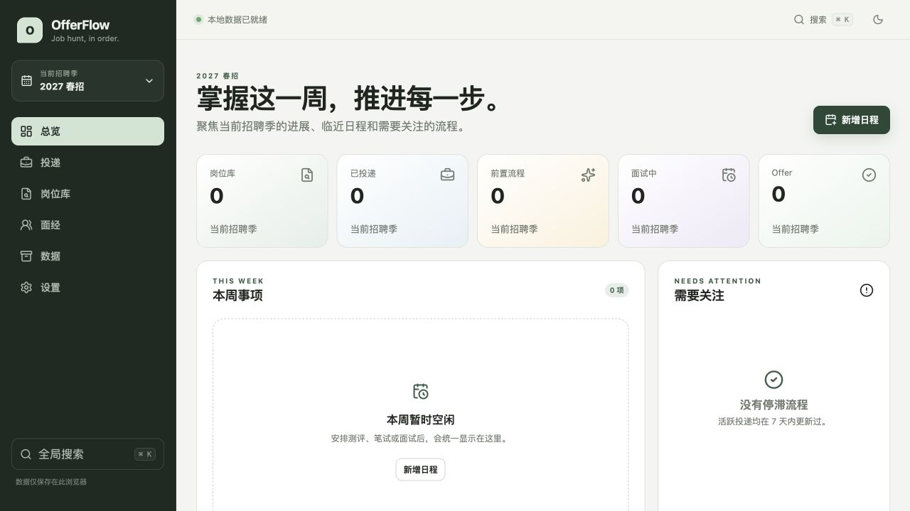

# OfferFlow

一个本地优先、单用户、开源的个人招聘季管理 Web 应用，用于集中维护岗位、投递、自定义流程、测评、笔试、面试、Offer、日程、面经和公司招聘官网登录信息。



## 功能

- 管理多个招聘季，支持切换、编辑、归档、恢复与删除
- 公司可跨招聘季复用，岗位和 JD 严格按招聘季隔离
- 保存 JD 原文，并维护可编辑的结构化 JD
- 投递看板和列表视图，支持筛选、排序与分页
- 每条投递拥有独立且可自定义的招聘流程
- 流程阶段始终映射到固定统计大类，便于统一统计
- 阶段和结果变更会生成不可被后续改名覆盖的历史快照
- 管理测评、笔试、面试、Offer 沟通、截止时间等日程
- 总览页面提供 KPI、本周事项、月历和停滞流程提醒
- 每场面试独立保存面经与个人复盘
- 支持安全净化后的 Markdown 编辑与预览
- 使用 `Cmd/Ctrl + K` 搜索当前招聘季的普通业务数据
- 公司招聘官网账号密码与普通数据分开存储，并使用 AES-GCM 加密
- 通过兼容 OpenAI 接口的服务商提纯 JD，内置可编辑的 SiliconFlow 示例配置
- 普通数据 JSON 备份与恢复、投递 CSV 导出
- 跟随系统、浅色和深色三种主题
- 使用 Hash Router，可直接部署到 GitHub Pages 等静态托管平台
- 推送 `v*` 标签时自动生成可离线托管的 ZIP 与 tar.gz 发行包

## GitHub Pages 使用入口

仓库启用 GitHub Pages，并在 **Settings → Pages → Build and deployment → Source** 中选择 **GitHub Actions** 后，每次推送到 `main` 都会执行测试、构建并发布 `dist/`。请不要选择 `Deploy from a branch`，否则 GitHub 会直接发布仓库源码，Vite 页面无法正常运行。

预期访问地址：

```text
https://gqrcherry.github.io/OfferFlow/
```

访问已发布页面不需要安装 Node.js、Python、数据库、Docker，也不需要注册账号。

## 本地运行

### 开发模式

```bash
npm install
npm run dev
```

### 构建生产版本

```bash
npm ci
npm test
npm run test:e2e
npm run build
```

使用 Python 启动静态服务器：

```bash
python -m http.server 8000 -d dist
```

或使用 `serve`：

```bash
npx serve dist
```

然后打开命令行显示的 HTTP 地址。由于浏览器对模块、IndexedDB 和 Web Crypto 的安全限制，不保证通过 `file://` 双击打开构建文件可以正常使用。

## 数据保存在哪里

普通业务数据保存在当前浏览器的 IndexedDB 数据库 `offerflow` 中。

招聘官网账号密码与 LLM API Key 保存在独立的敏感数据表中。本地持久化的敏感信息使用 AES-GCM 加密，密钥由当前浏览器在本地产生。

OfferFlow 不提供云同步。因此，不同浏览器、浏览器用户目录、设备、网站域名和无痕会话中的数据彼此独立。

## 浏览器数据清理风险与备份

清除网站数据、重置浏览器用户目录、卸载浏览器或更换部署域名，都可能永久删除本地 OfferFlow 数据。建议定期进入 **数据 → 导出 JSON**，并把备份保存在自己控制的位置。

- 普通 JSON 备份包含招聘季、公司、岗位、投递、流程历史、日程、面经和非敏感设置。
- 普通 JSON 和 CSV 不包含招聘官网密码、敏感账号标识、LLM API Key 或本地加密密钥。
- 导入会先校验 Schema 和实体引用关系，再写入数据库。
- 全量替换会清空当前普通数据，执行前应先导出当前备份。

## 招聘官网密码的安全边界

OfferFlow 是本地个人招聘管理工具，不是专业密码管理器。

无主密码模式主要用于降低普通数据泄露时的明文暴露风险。如果攻击者已经控制当前浏览器、操作系统账户、浏览器扩展或 OfferFlow 的执行环境，则无法保证敏感信息安全。

## LLM API Key 安全说明

不要把真实用户密钥写入 `.env`、`VITE_*`、源代码、Issue 或 Git 提交。纯前端应用无法隐藏构建期密钥。

请在 **设置 → AI · JD 提纯** 中填写 API Key，并选择：

- **加密保存到本地敏感数据区**：在当前浏览器中持久化；
- **仅本次会话**：会话结束后失效。

只有用户主动点击 **AI 提纯** 时，OfferFlow 才会把当前 JD 原文发送到配置的第三方模型服务。使用前请确认相应服务商的隐私政策。

### SiliconFlow 配置示例

```text
服务商：SiliconFlow
接口类型：兼容 OpenAI
Base URL：https://api.siliconflow.cn/v1
模型：Qwen/Qwen3-8B（可编辑，请以当前账号实际可用模型为准）
```

模型 ID 可能随服务商调整，因此模型字段允许用户修改，不作为不可变的业务常量。

### 自定义兼容 OpenAI 的服务商

```text
服务商：我的模型服务
Base URL：https://api.example.com/v1
模型：my-json-capable-model
API Key：在设置页面输入
```

服务商需要提供兼容的 `/chat/completions` 和 `/models` 接口，并允许来自 OfferFlow 网站域名的浏览器跨域请求。

## 隐私说明

- 不接入分析或遥测服务
- 不提供账号系统
- 不依赖后端或云数据库
- 不自动爬取岗位、登录招聘网站或自动投递
- 全局搜索不索引密码、API Key 和 JD 原文
- Markdown 渲染经过安全净化
- 外部链接使用 `noopener noreferrer`
- 除用户主动调用配置的 LLM 提纯 JD 外，业务数据不会离开浏览器

## 项目结构

```text
src/
├── app/                 # 路由、布局、全局状态与错误边界
├── components/          # 通用组件与安全 Markdown
├── db/                  # Dexie Schema、迁移和 Repository
├── features/            # 招聘季、岗位、投递、流程、日程、面经、AI、数据、搜索、设置
├── security/            # AES-GCM 敏感数据存储
├── test/                # 测试初始化与数据库工具
└── types/               # 领域类型
```

## 测试

```bash
npm test
npm run test:e2e
npm run build
```

浏览器 E2E 首次运行前需要安装 Chromium：`npx playwright install chromium`。

Vitest 覆盖默认及自定义流程、历史快照、流程复制、结构化 JD 校验、敏感数据过滤、导入导出往返、招聘季隔离和搜索隐私边界。Playwright 覆盖 PRD 指定的首次使用、招聘季隔离、创建投递、自定义流程、笔试日程、官网密码、普通导出、导入恢复和 GitHub Pages 静态路由场景。

## 参与贡献与安全问题

- [贡献指南](CONTRIBUTING.md)
- [安全策略](SECURITY.md)
- [产品需求文档](docs/Job-Hunt-PRD-v1.0.md)

## 许可证

[MIT](LICENSE)
